# Cell-Type-Specific Biomarker Discovery in Human Liver Fibrosis

A reproducible, modular **Snakemake + Scanpy** pipeline that discovers and prioritizes
**cell-type-specific biomarkers and therapeutic targets** in human liver fibrosis from
single-cell / single-nucleus RNA-seq.

- **Primary dataset:** [GSE136103](https://www.ncbi.nlm.nih.gov/geo/query/acc.cgi?acc=GSE136103),
  Ramachandran et al. 2019, *Nature*, "Resolving the fibrotic niche of human liver cirrhosis
  using single-cell transcriptomics."
- **Validation dataset:** [GSE244832](https://www.ncbi.nlm.nih.gov/geo/query/acc.cgi?acc=GSE244832),
  human MASLD/MASH liver snRNA-seq + snATAC (graded F0→F4). See
  [`docs/data_provenance.md`](docs/data_provenance.md) for why this set (and not GSE207310 / SCP2154).
- **Required compartments:** hepatic stellate / mesenchymal / myofibroblast · macrophage / monocyte ·
  endothelial.

The pipeline goes **ingest → QC → integrate → annotate → donor-aware DE → pathway/mechanism →
cell-cell communication → AI/ML biomarker prioritization → ranked 10 to 20 candidates → report**.

> Written answers to the 8 single-cell analysis design questions are in
> [`docs/written_answers.md`](docs/written_answers.md); the 1 to 2 page executive summary is
> rendered to `results/10_report/exec_summary.pdf`.

---

## Pipeline

End-to-end execution order (Snakemake rule graph):

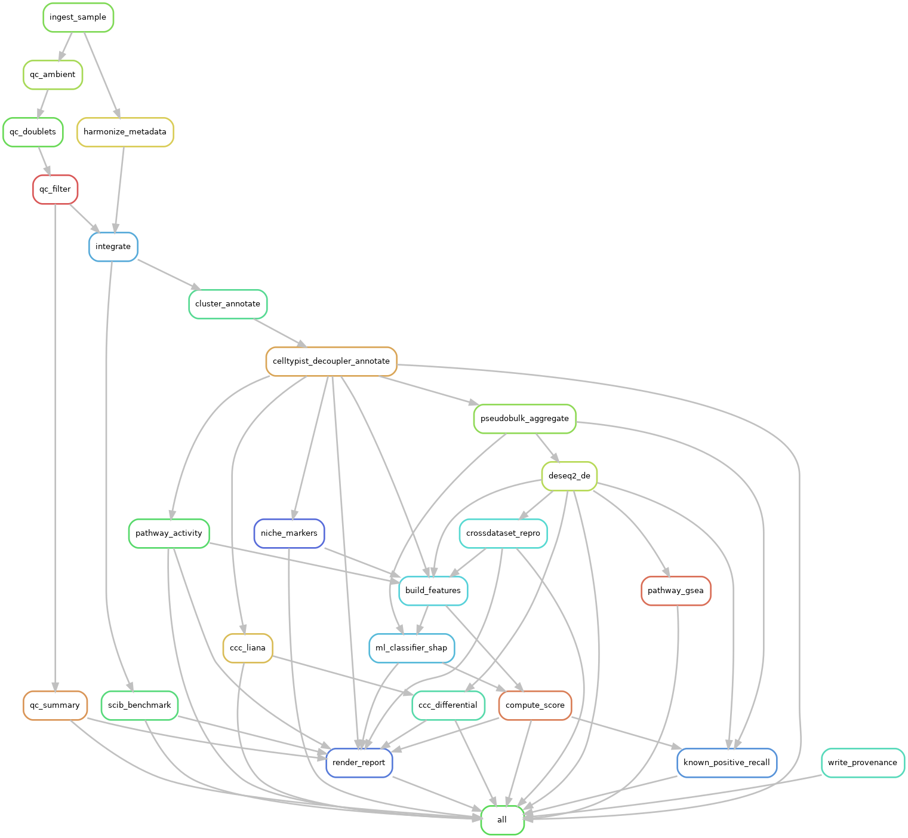

Each stage below shows a representative output from the **primary** cohort (GSE136103); the
pipeline regenerates all figures under `results/*/figures/` for both cohorts.

### 1 · Data acquisition & metadata harmonization
GEO `GSE136103_RAW.tar` → per-sample 10x matrices; heterogeneous fibrosis labels are mapped to a
common **`fibrosis_axis`** (`make_samplesheet.py`, `harmonize_metadata.py`).

> **`fibrosis_axis`** is a harmonized **ordinal fibrosis-severity scale, 0 = healthy/normal → 4 =
> cirrhosis/F4**, onto which each cohort's native labels are mapped (METAVIR F0 to F4, NASH/MASH
> grades, cirrhosis/non-cirrhosis). A binary **F2+** contrast (axis ≥ 2 = significant fibrosis) is
> derived for cross-cohort comparison. GSE136103's public metadata is only healthy/cirrhotic, so
> its axis is effectively binary (0 or 4); the graded gradient comes from the validation cohort.

### 2 · Quality control
Adaptive MAD filtering, liver/modality-aware mitochondrial ceiling, decontX ambient removal (with
cluster priors), Scrublet doublets; stressed/diseased cells deliberately retained *(one example
sample shown)*.

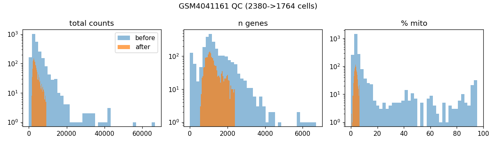

### 3 · Integration: batch-correct over donor, never disease
Harmony over `sample_id`; scIB metrics plus a fibrosis-signal guard that fails the run if the
disease axis collapses. Batches mix while condition is preserved.

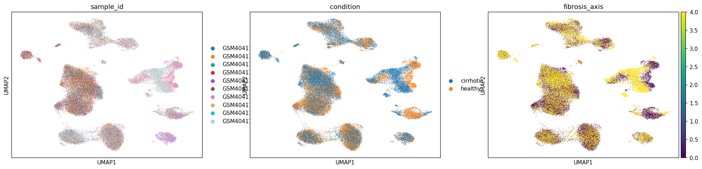
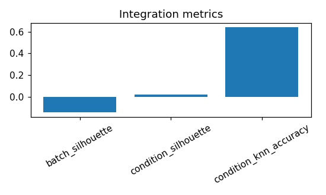

### 4 · Annotation & compartment validation
Leiden + marker scoring → cell types rolled to compartments, with disease-state and
stromal-discriminator scores written to `compartment_validation.tsv`.

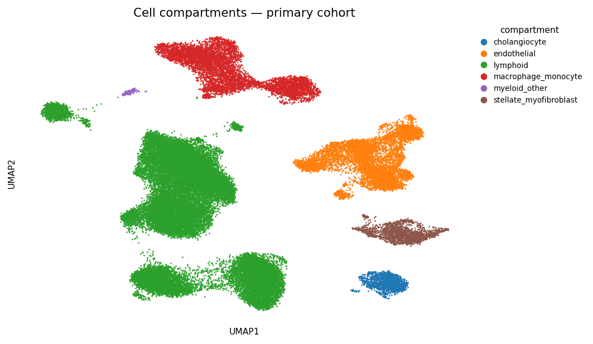
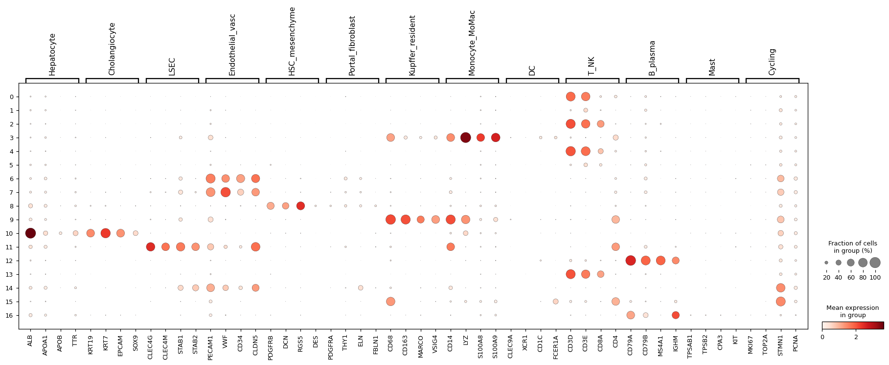

### 5 · Donor-aware DE + niche-level DE
Donor-level pseudobulk DESeq2 (replication unit = donor) per compartment, plus a subcluster-level
**niche** stage that recovers disease-subset biomarkers (PLVAP, TREM2) the compartment test
buries → `results/05_de/`. *(stellate / myofibroblast, cirrhotic vs healthy, shown)*

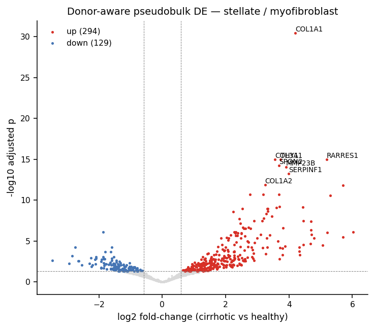

### 6 · Mechanism: pathway / TF activity & cell-cell communication
decoupler (PROGENy pathways, CollecTRI TFs) + GSEA; LIANA consensus ligand-receptor with
downstream-target corroboration.

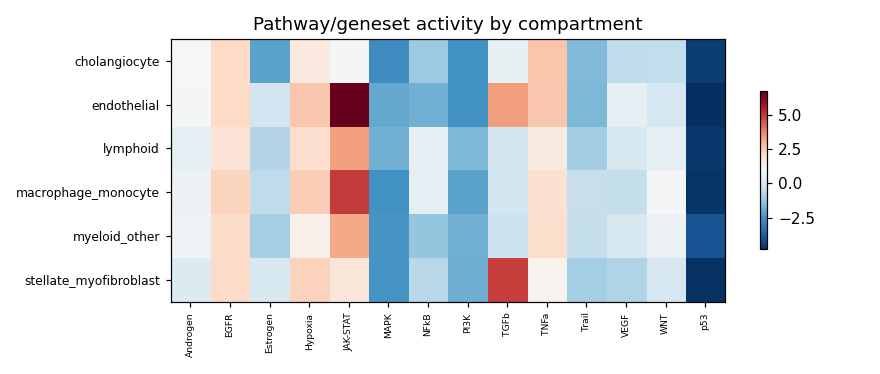

### 7 · Cross-dataset reproducibility
DE direction/rank concordance between primary and validation cohorts *(honest caveat: weak in
this cohort pair; see the Limitations section of [`docs/written_answers.md`](docs/written_answers.md))*.

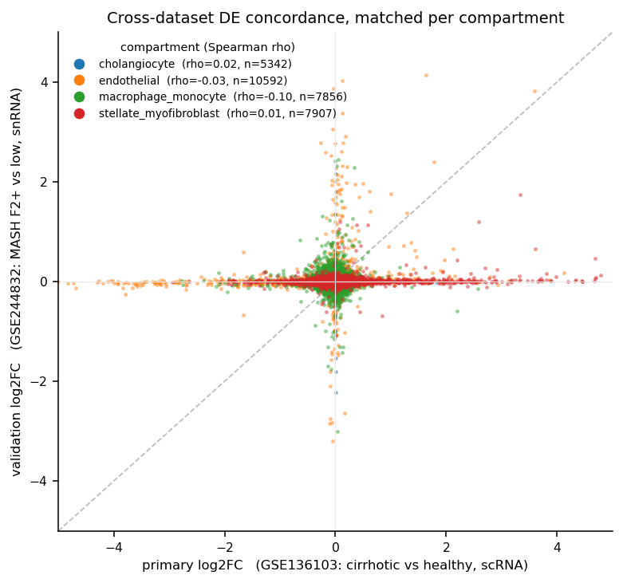

### 8 · Biomarker prioritization & known-positive recall
Each **(gene, compartment)** is scored by a transparent **composite**: a weighted sum of six
min-max-normalized components (weights in `config.yaml`):

| Component | weight | rewards |
|---|---|---|
| DE effect | 0.25 | effect size × significance (compartment DE **or** disease-niche marker) |
| cell-type specificity | 0.20 | tau, expressed in *this* compartment, not everywhere |
| cross-dataset reproducibility | 0.20 | same DE direction in the validation cohort |
| druggability | 0.15 | Open Targets tractability + DGIdb |
| accessibility | 0.10 | secreted > cell-surface > intracellular |
| ML / SHAP | 0.10 | XGBoost donor-grouped importance *(currently ~null, see Limitations)* |

Before ranking, a candidate must clear two **gates**: it must be **DE-significant** (compartment
or disease-niche) **and** pass a **specificity floor**, so abundant lineage markers and ambient
cross-compartment leakage cannot be ranked. Selection takes the top-N per required compartment,
then fills to the overall top-20. In the chart below, **bars are colored by compartment** (see
legend); the **known-positive recall** panel separately reports how many literature markers the
list recovers and *why* any are missed.

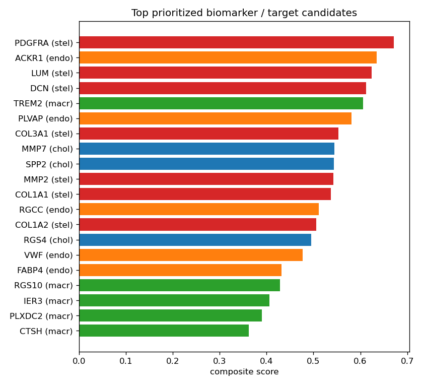
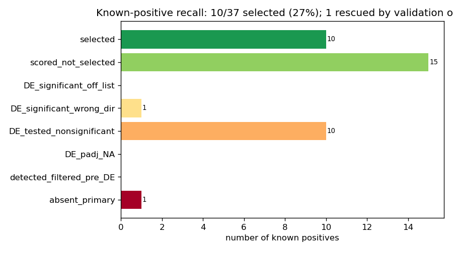

---

## Repository layout

```
config/        config.yaml (full) · config.test.yaml (tiny) · samples.tsv · markers_liver.yaml · schemas/
workflow/      Snakefile (entrypoint, auto-detected) · rules/*.smk · scripts/{py,R} · report/*.qmd
envs/          per-rule pinned conda environments
containers/    Dockerfile.base/.gpu · build.sh  (-> Singularity .sif for SLURM)
profiles/      local/ (this node)  ·  slurm/ (cluster executor + per-rule resources)
test/          downsampled fixture (data/ + samples.test.tsv) for end-to-end CI
docs/          reference_liver_cell_types_fibrosis.md · methods.md · data_provenance.md ·
               written_answers.md · risks.md · decisions/ (ADRs)
results/        all outputs (gitignored), staged per module + provenance/
```

The pipeline is **config-driven** (every threshold/choice lives in `config/`), **modular** (one rule
file per stage, one script per task), and **reproducible** (per-rule conda envs / containers, central
seeds, full provenance dump). It is GPU-optional: CPU defaults give a complete result; GPU methods
(scVI/scANVI, CellBender) are additive via `config.gpu.enabled`.

---

## Setup

Requires `conda` (a `snakemake` ≥7.28 is also assumed; the driver env below pins it).

```bash
# 1. Create the lightweight driver environment (snakemake + helpers)
conda env create -f environment.yml          # creates env: sc-liver
conda activate sc-liver

# 2. (recommended) install micromamba for FAST, reliable per-rule env creation
bash bin/install_micromamba.sh
export PATH="$HOME/.local/bin:$PATH"          # add to your shell rc

# 3. (optional) install git hooks
pre-commit install
```

Per-rule analysis environments in `envs/` are created automatically by Snakemake on first run
(`--use-conda`). The ~10 environments solve much faster with micromamba (step 2); pass
**`--conda-frontend mamba`** to use it (the CLI flag overrides the profile default of `conda`,
which is kept as a fallback for systems without micromamba). On this cluster there is no system
`mamba`, hence the bundled installer.

> The full pipeline has been verified end-to-end on the bundled fixture (`config.test.yaml`):
> all stages run to a Quarto report and a ranked candidate table with no failures.

---

## Quickstart: run the whole pipeline on the bundled test fixture (minutes, no cluster)

```bash
# dry-run: confirm the full DAG resolves for both dataset arms
snakemake -n --configfile config/config.test.yaml --profile profiles/local

# real end-to-end run on the tiny committed fixture
snakemake --configfile config/config.test.yaml --profile profiles/local \
          --use-conda --conda-frontend mamba
# -> results/10_report/report.html  +  candidate_scores.tsv  on fixture data
```

## Full run on real data (SLURM)

```bash
# 1. build the real samplesheet from GEO (one-time)
python workflow/scripts/py/make_samplesheet.py --config config/config.yaml --out config/samples.tsv

# 2. run the whole pipeline on the cluster
snakemake --configfile config/config.yaml --profile profiles/slurm \
          --use-conda --conda-frontend mamba
```

This downloads GSE136103 (+ GSE244832), runs every stage on the cluster, and produces the real
deliverables. Memory/time scale per-rule with retries; see `profiles/slurm/cluster_config.yaml`.

---

## Deliverables (regenerated by the pipeline)

| Deliverable | Path |
|---|---|
| QC summary + figures | `results/02_qc/<ds>/` |
| Cell annotation figures + compartment validation | `results/04_annotate/<ds>/` |
| Differential expression results | `results/05_de/<ds>/<compartment>/` |
| Pathway / mechanism results | `results/06_pathway/<ds>/` |
| Cell-cell communication results | `results/07_ccc/<ds>/` |
| **Ranked 10 to 20 biomarker/target table** | `results/08_score/candidate_scores.tsv` |
| Cross-dataset reproducibility | `results/09_crossdataset/repro_scores.tsv` |
| **Report (HTML + PDF) + executive summary** | `results/10_report/` |
| Provenance (resolved config, env lock, git SHA, DAG) | `results/provenance/` |

---

## How method choices map to the screening questions

| Q | Topic | Implemented in |
|---|---|---|
| 1 | Curation & fibrosis-stage harmonization | `rules/01_ingest.smk` → `harmonize_metadata`, `rules/09_crossdataset.smk` |
| 2 | QC / preprocessing | `rules/02_qc.smk` |
| 3 | Integration without erasing fibrosis biology | `rules/03_integrate.smk` (+ scIB guard) |
| 4 | Cell-type annotation & validation | `rules/04_annotate.smk` |
| 5 | Donor-aware differential expression | `rules/05_pseudobulk_de.smk` |
| 6 | AI/ML biomarker prioritization | `rules/08_score_ml.smk` |
| 7 | Cell-cell interaction & mechanism | `rules/06_pathway.smk`, `rules/07_ccc.smk` |
| 8 | Reproducible pipeline & delivery plan | this repository + `docs/methods.md` |

See `docs/methods.md` for the rationale and citations behind each choice.
